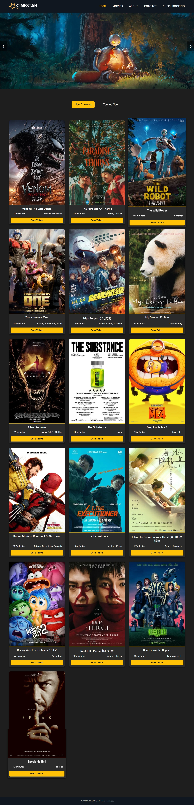
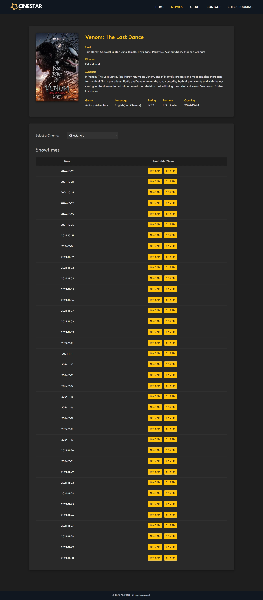
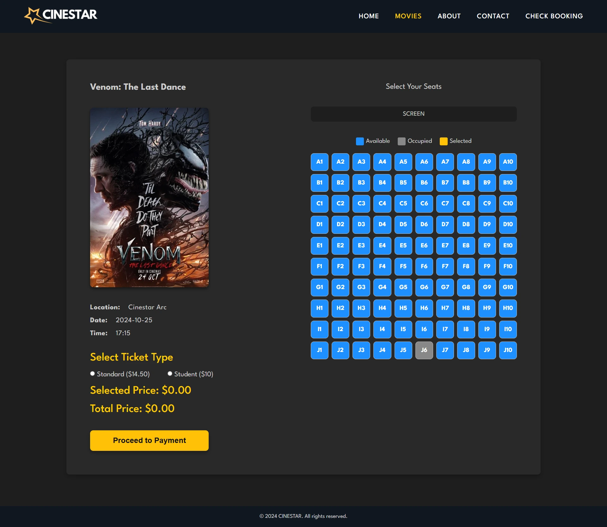

# 🎬 CINESTAR Cinema Booking System

CINESTAR is a full-stack cinema booking web application developed using `HTML`, `CSS`, `JavaScript`, `PHP`, and `MySQL`. The application allows users to browse movies, view movie details and available showtimes, select seats and ticket types, complete a payment form, receive an e-ticket, and retrieve existing bookings using their booking details.

The project integrates a JavaScript frontend with a PHP backend and a relational MySQL database to support the complete movie ticket booking workflow.

## 📷 Application Preview

<table align="center">
  <tr>
    <td align="center" valign="top">
      <em>Home page</em><br/>
      
    </td>
    <td align="center" valign="top">
      <em>Movie Page</em><br/>
       
    </td>
    <td align="center" valign="top">
      <em>Booking Page</em><br/>
       
    </td>
  </tr>
</table>

## ✨ Features

- Browse movies categorized into **Now Showing** and **Coming Soon**
- View detailed movie information, including:
  - Synopsis
  - Cast
  - Director
  - Genre
  - Language
  - Age rating
  - Runtime
  - Release date
- Browse movie showtimes by cinema, date, and time
- Select cinema location and movie showtime
- Choose between **Standard** and **Student** ticket types
- Select seats using an interactive cinema seat map
- Automatically calculate the total ticket price
- Complete payment details using **PayNow** or **MasterCard**
- Generate a unique booking reference ID
- Display an e-ticket after successful booking
- Store booking and selected seat information in the database
- Retrieve an existing booking using name, email, and booking ID
- Display retrieved booking information in a ticket details popup

## 🛠️ Technologies Used

- Frontend `HTML5`, `CSS3`, `JavaScript`, `Fetch API`, Web Storage (`localStorage`)
- Backend: `PHP`, `MySQLi`
- Database: `MySQL`, `SQL`, `phpMyAdmin`
- Development Environment: `XAMPP`, `Apache`

## 🗄️ Relational Database Design

The application uses a relational MySQL database named `cinestar` to manage movies, cinemas, halls, seats, showtimes, and booking information.

The database consists of eight related tables:

| Table           | Purpose                                                                                                                                        |
| --------------- | ---------------------------------------------------------------------------------------------------------------------------------------------- |
| `movies`        | Stores movie information including title, synopsis, cast, director, genre, language, runtime, release date, image path, status, and age rating |
| `cinemas`       | Stores cinema locations                                                                                                                        |
| `halls`         | Stores halls belonging to each cinema                                                                                                          |
| `hall_movies`   | Junction table associating movies with the halls in which they are shown                                                                       |
| `seats`         | Stores individual seats and their availability status for each cinema hall                                                                     |
| `showtimes`     | Stores scheduled movie screenings, including movie, cinema, hall, date, time, and ticket prices                                                |
| `bookings`      | Stores customer booking, payment, and booking reference information                                                                            |
| `booking_seats` | Junction table associating bookings with their selected seats                                                                                  |

### Database Relationships

The relational structure connects the main entities as follows:

```text
cinemas
   │
   │ 1 : many
   ▼
 halls ──────────────── seats
   │                     ▲
   │                     │
   │                     │
   ├── hall_movies       │
   │       │             │
   │       ▼             │
   │     movies          │
   │       │             │
   │       ▼             │
   └── showtimes         │
           │             │
           ▼             │
        bookings         │
           │             │
           ▼             │
     booking_seats ──────┘
```

The main relationships include:

- A **cinema** can contain multiple **halls**.
- A **hall** can contain multiple **seats**.
- **Movies** and **halls** are associated through the `hall_movies` junction table.
- A **movie** can have multiple **showtimes**.
- Each **showtime** is associated with a movie, cinema, and hall.
- A **booking** is associated with a movie, cinema, hall, and showtime.
- A booking can contain multiple selected seats.
- The `booking_seats` junction table associates each booking with its selected seats.

### Keys and Constraints

The database uses **primary keys**, **foreign keys**, **composite keys**, and **junction tables** to maintain relationships and referential integrity.

Examples include:

- `movies.movie_id` — primary key for movies
- `cinemas.cinema_id` — primary key for cinemas
- `showtimes.showtime_id` — auto-incrementing primary key for showtimes
- `bookings.booking_id` — auto-incrementing primary key for bookings
- `bookings.reference_id` — unique booking reference
- `(hall_id, cinema_id)` — composite primary key identifying a hall within a cinema
- `(cinema_id, hall_id, seat_id)` — composite primary key identifying a seat within a cinema hall
- `(hall_id, cinema_id, movie_id)` — composite key used by `hall_movies`
- `(reference_id, cinema_id, hall_id, seat_id)` — composite key used by `booking_seats`

Foreign key relationships are used to connect related records and maintain referential integrity between the tables.

### Booking Data Model

When a booking is completed, the application stores the overall booking information separately from the selected seats:

```text
bookings
   │
   │ reference_id
   │
   │ 1 : many
   ▼
booking_seats
   │
   │ cinema_id + hall_id + seat_id
   ▼
seats
```

This allows a single booking to contain multiple seats without storing multiple seat values directly inside the `bookings` table.

The application also uses a database transaction when saving a booking so that the booking record, selected booking seats, and seat availability updates are handled together.

## 🔄 Application Workflow

The main booking workflow follows:

1. **Browse Movies**
   - Movies are retrieved from MySQL through the PHP backend.
   - Movies are displayed as Now Showing or Coming Soon.

2. **View Movie Details**
   - Users select a movie to view its information.
   - Available showtimes are retrieved and grouped by cinema, date, and time.

3. **Select Showtime**
   - Users choose a cinema location, date, and showtime.

4. **Select Ticket and Seat**
   - The application generates an interactive cinema seat map.
   - Users select a ticket type and available seat.
   - The total price is calculated based on the selected ticket price and number of seats.

5. **Payment**
   - Booking information is temporarily stored using `localStorage`.
   - Users choose PayNow or MasterCard and complete the required payment form.

6. **Booking Confirmation**
   - A unique booking reference ID is generated.
   - Booking and seat information is stored in the MySQL database.
   - An e-ticket containing the booking details is displayed.

7. **Check Booking**
   - Users can retrieve an existing booking using their name, email, and booking ID.
   - Matching booking information is retrieved from MySQL and displayed in a popup.

## 🔌 Backend API

The frontend communicates with PHP endpoints using the JavaScript Fetch API.

| Endpoint                | Purpose                                                                        |
| ----------------------- | ------------------------------------------------------------------------------ |
| `getMovies.php`         | Retrieves Now Showing and Coming Soon movies                                   |
| `getMovieDetails.php`   | Retrieves movie details and available showtimes                                |
| `getBookingDetails.php` | Retrieves selected screening details: movie, cinema, hall, ticket price, and seat availability |
| `getSeatsId.php`        | Retrieves database seat IDs for selected seats & Converts selected seat labels into database seat IDs                                 |
| `checkReferenceID.php`  | Checks whether a generated booking reference ID is unique                      |
| `saveBooking.php`       | Saves booking and selected seat information to the MySQL database                    |
| `checkBooking.php`      | Retrieves an existing booking using customer and booking information: name, email and booking ID reference           |

## 💾 Data Flow

The application uses `JSON` and the `Fetch API` for communication between the frontend and PHP backend.

```text
Browser
   │
   │ JavaScript / Fetch API
   ▼
PHP Backend
   │
   │ MySQLi / SQL
   ▼
MySQL Database
   │
   │ Query Results
   ▼
PHP JSON Response
   │
   ▼
JavaScript
   │
   ▼
Dynamic User Interface
```

> `localStorage` is also used to maintain booking information while users move between the booking, payment, and confirmation pages.

## 🚀 Running the Project Locally

### Prerequisites

Install **XAMPP**, which provides the Apache web server, PHP, and MySQL required to run the application locally.

### 1. Clone the Repository

```bash
git clone https://github.com/YOUR-USERNAME/cinema-booking-system.git
```

### 2. Move the Project into XAMPP

Place the project directory inside:

```text
C:\xampp\htdocs\
```

For example:

```text
C:\xampp\htdocs\cinestar\
```

### 3. Start Apache and MySQL

Open the **XAMPP Control Panel** and start:

- Apache
- MySQL

### 4. Import the Database

Open **phpMyAdmin** in your browser.

Import:

```text
movie_database.sql
```

The SQL script creates and uses the:

```text
cinestar
```

database and populates the required tables and seed data.

### 5. Verify the Database Connection

The PHP backend is configured to connect to the local MySQL database using:

```php
$servername = "localhost";
$username = "root";
$password = "";
$dbname = "cinestar";
```

Update these values if your local MySQL configuration is different.

### 6. Open the Application

If Apache is running on its default port, open:

```text
http://localhost/cinestar/
```

If Apache is configured to use another port, include that port in the URL.

For example:

```text
http://localhost:8000/cinestar/
```

## 🧪 Tested User Flow

The following end-to-end workflow has been tested locally:

```text
Browse Movies
      ↓
View Movie Details
      ↓
Select Cinema & Showtime
      ↓
Select Ticket Type & Seat
      ↓
Proceed to Payment
      ↓
Complete PayNow Payment Form
      ↓
Generate E-Ticket
      ↓
Save Booking to MySQL
      ↓
Retrieve Booking from Check Booking Page
```

The booking was successfully persisted in the `bookings` and `booking_seats` tables and subsequently retrieved through the **Check Booking** functionality.

## 🧩 Challenges & Solutions

### 1. Managing Data Across a Multi-Page Booking Workflow

**Challenge:**  
The booking process spans multiple pages, including movie details, seat selection, payment, and booking confirmation. Data such as the selected movie, cinema, showtime, ticket type, seats, and total price needed to remain available as users navigated between these pages.

**Solution:**  
Used URL query parameters to pass movie and showtime selections between the initial pages and created a `bookingDetails` object containing the complete booking information. The object was stored in browser `localStorage`, allowing subsequent pages to retrieve and use the same booking data throughout the payment and confirmation workflow.

---

### 2. Implementing Dynamic Seat Selection and Mapping Seats to Database Records

**Challenge:**  
The seat-selection interface needed to dynamically display cinema seats, prevent unavailable seats from being selected, and associate user-facing seat labels such as `A1` or `J6` with the corresponding records in the MySQL database.

**Solution:**  
Generated a 10 × 10 seat map dynamically using JavaScript and managed seat selection through event handling. Existing unavailable seats were retrieved from the backend and reflected in the interface. Selected seat labels were sent to `getSeatsId.php` using the Fetch API, where they were mapped to their corresponding database seat IDs before being included in the booking data.

---

### 3. Designing a Relational Database for the Cinema Booking System

**Challenge:**  
The application needed to represent multiple related entities, including movies, cinemas, halls, seats, showtimes, bookings, and selected booking seats. Storing all of this information in a single table would create duplicated data and make the relationships difficult to manage.

**Solution:**  
Designed a relational MySQL database consisting of eight tables:

- `movies`
- `cinemas`
- `halls`
- `hall_movies`
- `seats`
- `showtimes`
- `bookings`
- `booking_seats`

Used primary keys, foreign keys, composite keys, and junction tables to establish relationships between the entities. For example, `hall_movies` associates movies with halls, while `booking_seats` associates a booking with its selected seats.

---

### 4. Integrating the JavaScript Frontend with PHP and MySQL

**Challenge:**  
The frontend needed to retrieve and update database information without directly accessing MySQL from the browser. Different parts of the application required movie information, showtimes, booking details, seat information, and existing booking records.

**Solution:**  
Created PHP backend endpoints for specific application operations and used the JavaScript Fetch API for asynchronous frontend-backend communication. PHP processes the requests, communicates with MySQL using MySQLi and SQL queries, and returns data to the frontend as JSON.

```text
JavaScript
    ↓ Fetch API
PHP Backend
    ↓ MySQLi / SQL
MySQL
    ↓ Query Results
PHP / JSON
    ↓
JavaScript
    ↓
Dynamic UI
```

---

### 5. Maintaining Data Consistency When Saving a Booking

**Challenge:**  
Completing a booking requires multiple related database operations: creating the booking record, associating the selected seats with the booking, and updating seat availability. If one operation failed after another had already succeeded, the database could be left with incomplete booking information.

**Solution:**  
Used a MySQL database transaction in `saveBooking.php` to group the related database operations together. The booking is committed only after the required operations complete successfully. If an exception occurs during the process, the transaction is rolled back to prevent a partially completed booking from being stored.

```text
Begin Transaction
      ↓
Insert Booking
      ↓
Insert Selected Booking Seats
      ↓
Update Seat Availability
      ↓
Success → COMMIT
Failure → ROLLBACK
```

---

### 6. Generating a Unique Booking Reference

**Challenge:**  
Each booking required a reference ID that could be displayed on the e-ticket and later used to retrieve the booking. The application needed to avoid assigning an existing reference ID to a new booking.

**Solution:**  
Generated a 10-character alphanumeric booking reference on the confirmation page and sent it to `checkReferenceID.php`. The backend checks the `bookings` table to determine whether the reference already exists. A unique reference is then stored with the booking and displayed on the generated e-ticket.

---

### 7. Retrieving Complete Booking Information from Multiple Tables

**Challenge:**  
The Check Booking feature needed to reconstruct a complete ticket even though the required information was distributed across multiple relational database tables.

**Solution:**  
Implemented `checkBooking.php` to retrieve related booking information using SQL joins across the booking, movie, cinema, hall, showtime, and seat-related data. Multiple selected seats are combined using `GROUP_CONCAT`, and the resulting booking information is returned to the frontend and dynamically displayed in a ticket details popup.

---

### 8. Dynamically Rendering Movies and Showtimes from Database Data

**Challenge:**  
The number of movies, cinemas, dates, and showtimes can vary based on the records stored in the database. Hard-coding each movie card and showtime into HTML would make the application difficult to maintain.

**Solution:**  
Retrieved movie and showtime information from MySQL through PHP endpoints and dynamically generated the corresponding frontend elements using JavaScript. Movie listings are populated from the database, while showtimes are organized by cinema, date, and time before being presented to the user.

## 💡 Key Learnings

- Developed an understanding of **full-stack application architecture** by integrating JavaScript frontend interfaces with PHP backend endpoints and a MySQL relational database.
- Applied **relational database design** using primary keys, foreign keys, composite keys, and junction tables to model movies, cinemas, halls, showtimes, seats, and bookings.
- Implemented **asynchronous frontend-backend communication** using the Fetch API and JSON to retrieve and persist application data.
- Learned to manage **state across a multi-page workflow** using URL parameters and `localStorage` to maintain booking information from movie selection through confirmation.
- Applied **database transactions** to coordinate booking creation, selected-seat records, and seat availability updates while maintaining data consistency.

<!-- ## 📚 Key Concepts Applied

This project demonstrates practical use of:

- Full-stack web application development
- Client-server architecture
- Asynchronous frontend-backend communication
- REST-style PHP endpoints
- JSON request and response handling
- DOM manipulation and event handling
- Client-side form validation
- Browser Web Storage
- Relational database design
- Primary and foreign key relationships
- Composite keys
- Junction tables
- SQL joins
- Prepared statements
- Database transactions
- Dynamic UI rendering -->
